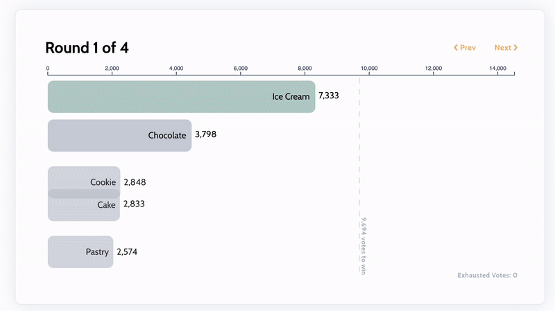

# Ranked Choice

- nSLOC: 140

# About

With a US election coming up, we started thinking about elections and how... well they suck. Most governments follow a "1 person 1 vote" style voting, which ultimately [leads to a 2 party system](https://www.youtube.com/watch?v=qf7ws2DF-zk). So, for our project, we decided to implement a ranked choice on-chain voting mechanism! 

Our project showcases a ranked choice voting smart contract. The contract will have a specific set of voters initialized at construction, so we don't have to worry about sybil attacks. 

The setup looks as such:

1. The initial president is set as the msg.sender, and each president should have a term of roughly 4 years (1460 days).
2. Voters can call `rankCandidates` to rank candidates (which can be any address) any time to queue up their votes for the next president. 
3. After the 4 year term has passed, anyone can call `selectPresident` which will select the new `s_currentPresident` based on the queued up ranks of each voter.
4. Voters can also sign an un-sent transaction so others can spend the gas to cast their vote with `rankCandidatesBySig`


## About Ranked Choice Voting

Ranked choice voting is where candidates rank their choices, as opposed to voting for a single candidate. Once all votes have been collected, candidates go through "rounds" to choose a new president. Each "round" the candidate with the least votes is eliminated, and voters who selected that candidate who was removed will have their vote then count for whoever was selected next. You can see a gif of it here.


> Gif from [ballotpedia](https://ballotpedia.org/Ranked-choice_voting_(RCV))

# Getting Started 

## Requirements

- [git](https://git-scm.com/book/en/v2/Getting-Started-Installing-Git)
  - You'll know you did it right if you can run `git --version` and you see a response like `git version x.x.x`
- [foundry](https://getfoundry.sh/)
  - You'll know you did it right if you can run `forge --version` and you see a response like `forge 0.2.0 (816e00b 2023-03-16T00:05:26.396218Z)`
- [soldeer](https://soldeer.xyz/)
  - You'll know you did it right if you can run `soldeer --version` and you see a response like `soldeer 0.x.x`

## Installation

This repo uses [https://soldeer.xyz/] for package management. If you haven't installed [soldeer](https://soldeer.xyz/), head over to their documentation to get started. 

```bash
git clone https://github.com/Cyfrin/2024-09-president-elector
cd 2024-09-president-elector
soldeer install
forge build
```

## Quickstart

```bash
forge test
```

# Scope

```
./src/RankedChoice.sol
```

# Compatibilities

- solc_version: "0.8.24"
- Chain(s) to deploy to:
    - ETH Mainnet
- Deployment information:
    - Out of scope
- Tokens:
    - None

# Actors

- Voters: Users who can vote for president. They are identified at construction time.
- Candidates: Users who received at least 1 vote.
- President: The current winner of the ranked choice algorithm. 

# Known Issues

- In `_selectPresidentRecursive` there is an issue where if two candidates are tied, whoever was earlier in the list is dropped. This is known, and we are OK with it.
- There are other issues with this style of voting, like for example, in some cases a candidate who does worse will win. You can see a [longer explainer here.](https://www.youtube.com/watch?v=qf7ws2DF-zk)
- We know that `1460 days` is not exactly 4 years. We are OK with that.